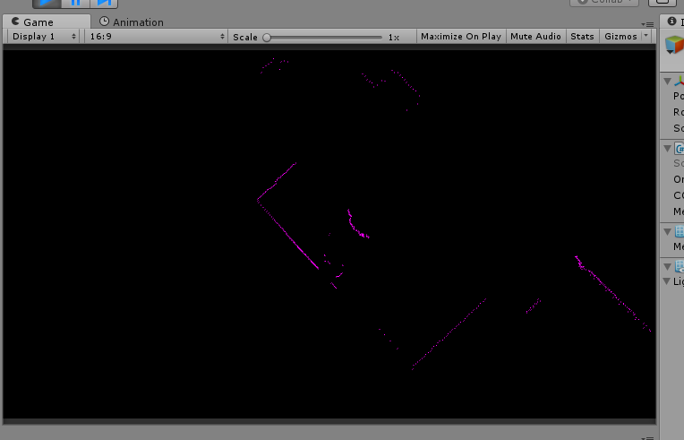

# Rplidar-Unity
A simple wrapper of Rplidar API integrates with Unity.

## Quick Start
1. Launch Unity with the project '/RplidarUnity'. Then open sample scene at `/Assets/RplidarTest/RadarTest.unity`.
2. Set the correct COM port on the inspector of GameObject "Rplidar"(for example COM3)
3. Press Run button and then click the GUI buttons onConnect - startMotor - startScan. If everything is correct, the radar starts rotating.
4. Click the button grabData you will see data print on the console window.
5. Another sample scene `Assets/RadarMap.Unity` will convert the grabbed data to points mesh and render to the camera. Just open this scene then press run.

## Other issues
Everything was tested only on Windows system currently.
You can recompile the c++ dll with visual studio solution /RplidarCpp/RplidarCpp.sln.

Only release DLL can be used for exported unity executable program on other PC. 

## License
MIT
